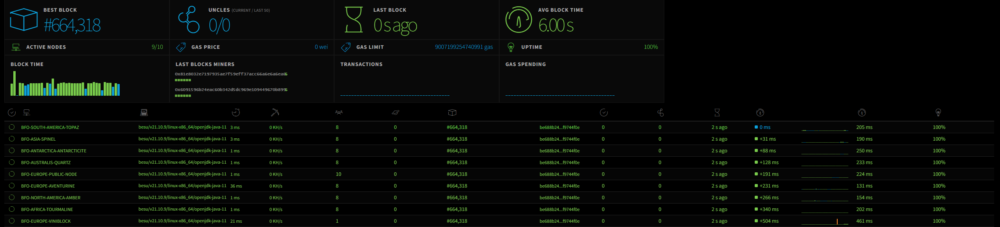

# BFO network node
**Repository for the client to join the BFO network.**

The BFO network is an open, Proof-of-Authority, Ethereum network with 6 second block times and no gas costs. 


## About
The blockchain network underlying this system is Ethereum, using a Proof-of-Authority consensus engine. Proof-of-Authority is a replacement for Proof-of-Work and is well suited for consortium and semi-public chain setups as it does not depend on nodes solving arbitrarily complex mathematical problems, but instead uses a set of "authorities" - nodes that are explicitly allowed to create new blocks and secure the blockchain. A Poof-of-Authority chain has to be signed off by the majority of authorities and when this is done, the record is permanently committed and recorded.

In a consortium setting, there are only advantages to using a Proof-of-Authority network. It is more secure than a small Proof-of-Work network since an attacker who gains unwanted connection or who has hacked an authority cannot overwhelm the network to modify or revert transaction. It is less computationally intensive, more performant and more predictable. The tradeoff is that there is a level of trust for the nodes that have been assigned the mining authority.


## BFO network Statistics



BFO network is such a semi-public network. It has been configured in such a way that transaction costs (gas) that are associated with Ethereum transactions are removed and blocks are created in 6 second intervals. This eliminates the need for complex steps to fund wallets prior to executing a transaction on the network and it prevents having to deal with the unstable cryptocurrency exchange rates. More statistics on https://stats-bfo.bfo-dlt.com/

Running a node
To run a node on the network, you should use the provided Docker container.

Docker is easy to install following the instructions for Ubuntu, MacOS, and Windows.

To run the node, start the BFO network Docker container like so:

```
$ docker run -d bfodlt/public-besu-peer

Unable to find image 'bfodlt/public-besu-peer:latest' locally
latest: Pulling from bfodlt/public-besu-peer
ea362f368469: Already exists
b6320c011764: Already exists
33796e6ad525: Already exists
7aed7ac692f6: Pull complete
Digest: sha256:64d941a895b3fa4d342a213b494c7d0aafce537884d4b930cde8aa7d9e82fe12
Status: Downloaded newer image for bfodlt/public-besu-peer:latest
b1f823d43180b3c1fdda82c5f9d2be50f301bd049f98626ceef3d3e0738d62c9
```


Check if the node is running:

```
$ docker ps
CONTAINER ID   IMAGE                     COMMAND                  CREATED              STATUS                        PORTS                                 NAMES
b1f823d43180   bfodlt/public-besu-peer   "/bin/sh -c '/srv/st…"   About a minute ago   Up About a minute (healthy)   8545-8547/tcp, 30303/tcp, 30303/udp   festive_newton
```

And follow the progress and action of the node by tailing the logs.

```
$ docker logs -f b1f823d43180
2022-03-13 19:12:48.661+00:00 | main | INFO  | Besu | Using LibEthPairings native alt bn128
2022-03-13 19:12:48.662+00:00 | main | INFO  | Besu | Using the native implementation of the signature algorithm
2022-03-13 19:12:48.665+00:00 | main | INFO  | Besu | Starting Besu version: besu/v21.10.9/linux-x86_64/openjdk-java-11
2022-03-13 19:12:48.760+00:00 | main | INFO  | Besu | Static Nodes file = /data/static-nodes.json
2022-03-13 19:12:48.778+00:00 | main | INFO  | Besu | Connecting to 1 static nodes.
2022-03-13 19:12:48.780+00:00 | main | INFO  | Besu | Security Module: localfile
2022-03-13 19:12:48.789+00:00 | main | INFO  | RocksDBKeyValueStorageFactory | No existing database detected at /data. Using version 1
2022-03-13 19:12:49.025+00:00 | main | INFO  | KeyPairUtil | Generated new public key 0x52804b4928b04dfe083dfd40c2cf1666f965346ef5c005759260a47345d2c9ac768c1df9af201c8673ad8222f90ca84fe1c588830a3242b2beaeb844d351f9b6 and stored it to /data/key
2022-03-13 19:12:49.096+00:00 | main | INFO  | ProtocolScheduleBuilder | Protocol schedule created with milestones: [MuirGlacier: 0]
2022-03-13 19:12:49.165+00:00 | main | INFO  | RunnerBuilder | Detecting NAT service.
2022-03-13 19:12:49.404+00:00 | main | INFO  | Runner | Starting Ethereum main loop ...
2022-03-13 19:12:49.404+00:00 | main | INFO  | DockerNatManager | Starting docker NAT manager.
2022-03-13 19:12:56.604+00:00 | main | INFO  | NetworkRunner | Starting Network.
2022-03-13 19:12:56.647+00:00 | nioEventLoopGroup-2-1 | INFO  | RlpxAgent | P2P RLPx agent started and listening on /0.0.0.0:30303.
2022-03-13 19:12:56.648+00:00 | main | INFO  | PeerDiscoveryAgent | Starting peer discovery agent on host=0.0.0.0, port=30303
2022-03-13 19:12:56.670+00:00 | vert.x-eventloop-thread-1 | INFO  | VertxPeerDiscoveryAgent | Started peer discovery agent successfully, on effective host=0.0.0.0 and port=30303
2022-03-13 19:12:56.671+00:00 | vert.x-eventloop-thread-1 | INFO  | PeerDiscoveryAgent | P2P peer discovery agent started and listening on /0.0.0.0:30303
2022-03-13 19:12:56.695+00:00 | vert.x-eventloop-thread-1 | INFO  | PeerDiscoveryAgent | Writing node record to disk. NodeRecord{seq=1, publicKey=0x0252804b4928b04dfe083dfd40c2cf1666f965346ef5c005759260a47345d2c9ac, udpAddress=Optional[/127.0.0.1:30303], tcpAddress=Optional[/127.0.0.1:30303], asBase64=-Je4QMoBhvbZhGfdXy7rmNdvE1dcGjqLbHSR9kK4xErN_y6AYWzGHigllJrr0oG5u3LLHXJUG8uRc7VjbHi-8BRDW1wBg2V0aMfGhDfcDxmAgmlkgnY0gmlwhH8AAAGJc2VjcDI1NmsxoQJSgEtJKLBN_gg9_UDCzxZm-WU0bvXABXWSYKRzRdLJrIN0Y3CCdl-DdWRwgnZf, nodeId=0xee37ab504bd15bfe3d5ab3139d4173a1eeae464e0dddfea918eae836c2df2902, customFields={tcp=30303, udp=30303, ip=0x7f000001, eth=[[0x37dc0f19, 0x]], id=V4, secp256k1=0x0252804b4928b04dfe083dfd40c2cf1666f965346ef5c005759260a47345d2c9ac}}
2022-03-13 19:12:56.708+00:00 | main | INFO  | DefaultP2PNetwork | Enode URL enode://52804b4928b04dfe083dfd40c2cf1666f965346ef5c005759260a47345d2c9ac768c1df9af201c8673ad8222f90ca84fe1c588830a3242b2beaeb844d351f9b6@127.0.0.1:30303
2022-03-13 19:12:56.709+00:00 | main | INFO  | DefaultP2PNetwork | Node address 0x9d4173a1eeae464e0dddfea918eae836c2df2902
2022-03-13 19:12:56.710+00:00 | main | INFO  | DefaultSynchronizer | Starting synchronizer.
2022-03-13 19:12:56.711+00:00 | main | INFO  | FullSyncDownloader | Starting full sync.
2022-03-13 19:12:56.711+00:00 | main | INFO  | FullSyncTargetManager | No sync target, waiting for peers: 0
2022-03-13 19:12:56.721+00:00 | main | INFO  | JsonRpcHttpService | Starting JSON-RPC service on 0.0.0.0:8545
2022-03-13 19:12:56.743+00:00 | vert.x-eventloop-thread-1 | INFO  | JsonRpcHttpService | JSON-RPC service started and listening on 0.0.0.0:8545
2022-03-13 19:12:56.743+00:00 | main | INFO  | GraphQLHttpService | Starting GraphQL HTTP service on 0.0.0.0:8547
2022-03-13 19:12:56.746+00:00 | vert.x-eventloop-thread-1 | INFO  | GraphQLHttpService | GraphQL HTTP service started and listening on 0.0.0.0:8547
2022-03-13 19:12:56.746+00:00 | main | INFO  | WebSocketService | Starting Websocket service on 0.0.0.0:8546
2022-03-13 19:12:56.750+00:00 | vert.x-eventloop-thread-1 | INFO  | WebSocketService | Websocket service started and listening on 0.0.0.0:8546
2022-03-13 19:12:56.751+00:00 | main | INFO  | Runner | Ethereum main loop is up.
2022-03-13 19:12:56.753+00:00 | main | INFO  | AutoTransactionLogBloomCachingService | Starting auto transaction log bloom caching service.
2022-03-13 19:12:56.753+00:00 | main | INFO  | LogBloomCacheMetadata | Lookup cache metadata file in data directory: /data/caches
2022-03-13 19:12:58.873+00:00 | nioEventLoopGroup-3-1 | INFO  | FullSyncTargetManager | No sync target, waiting for peers: 1
2022-03-13 19:13:03.876+00:00 | EthScheduler-Timer-0 | INFO  | SyncTargetManager | Found common ancestor with peer Peer 0xf0d61ff16fd51af205... at block 0
2022-03-13 19:13:04.383+00:00 | EthScheduler-Services-5 (importBlock) | INFO  | FullImportBlockStep | Import reached block 200 (0x1a9668cbfe84dc6fb343dff4fef444d9af45026c62d91740e1f7b74b88cf55f9), - Mg/s, Peers: 1
2022-03-13 19:13:04.536+00:00 | EthScheduler-Services-5 (importBlock) | INFO  | FullImportBlockStep | Import reached block 400 (0x08570726d02551b821ed686f795c78f42e30a48c87efeb6b7802623f7db5e5ed), - Mg/s, Peers: 1
2022-03-13 19:13:04.661+00:00 | EthScheduler-Services-5 (importBlock) | INFO  | FullImportBlockStep | Import reached block 600 (0x7fa4c7a9506decbf6df77bffab5e0816560e8c0e350488dfc33fbe45d4241ce1), - Mg/s, Peers: 1
2022-03-13 19:13:04.789+00:00 | EthScheduler-Services-5 (importBlock) | INFO  | FullImportBlockStep | Import reached block 800 (0x5fdc23d760365f4b1be18c67bbf0a62d51ea39e86c63ad5bfc2211db3dad2447), - Mg/s, Peers: 1
2022-03-13 19:13:04.895+00:00 | EthScheduler-Services-5 (importBlock) | INFO  | FullImportBlockStep | Import reached block 1000 (0x604ecf3ea3f9a180086d05bc929ed6d4929b2540f688cea7a609efe6dd1daa76), - Mg/s, Peers: 1
2022-03-13 19:13:04.998+00:00 | EthScheduler-Services-5 (importBlock) | INFO  | FullImportBlockStep | Import reached block 1200 (0x3ebffd7463dcc0d61b79c09d315289f10aeac228a9b5d55a4c69c56808749cc8), - Mg/s, Peers: 1
```

Adding your node to the statistics interface
The statistics interface is built on the Ethereum Network Intelligence API. Using the following Docker Compose file to run both your node and the statistics tool, your node will appear within seconds in the interface.

```
version: "3.8"

services:
  ethereum-node:
    image: "bfodlt/public-besu-peer"
    restart: always
    ports:
      - "30303:30303"
      - "30303:30303/udp"
      - "8545:8545"
  ethstats-client:
    image: "bfodlt/ethstats-client"
    restart: always
    depends_on:
      - "ethereum-node"
    command:
      [
        "./scripts/wait-for-it.sh",
        "ethereum-node:8545",
        "--",
        "npm",
        "run",
        "start",
      ]
    environment:
      INSTANCE_NAME: "YOUR-NODE-NAME"
      WS_SECRET: "2tzi6gckshPAagLAbxWo"
      WS_SERVER: "https://stats-bfo.bfo-dlt.com"
      RPC_HOST: "ethereum-node"
```

You can also clone this repo and run:

```
$ docker-compose up -d
```
